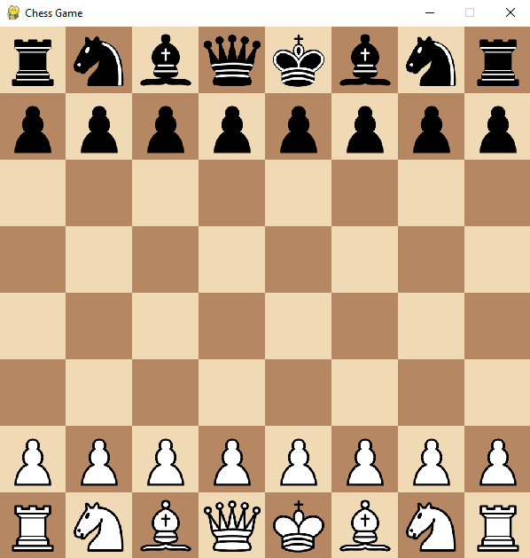

# Chess Game ♟

A basic chess game implemented in Python using the Pygame library. It features a graphical user interface (GUI), allowing a human player to play against a simple computer AI.




## 🎮 Game Features

*   **Graphical User Interface:** A visual chess board with piece images.
*   **Basic Game Logic:** Implements the fundamental rules of chess, including move validation, check/checkmate detection.
*   **Simple Computer AI:** Opponent that chooses moves randomly from all legal moves.
*   **Piece Movement:** Implements specific valid moves for pawns, rooks, knights, bishops, queens, and kings.
*   **Check and Checkmate Detection:** Detects if the king is in check and if the game ends in checkmate.

## 🚀 How to Run

1. **Installing with Conda**
    ```bash
    conda create -n chess python pygame --yes
    conda activate chess
    ```
2.  **Clone the Repository:**
    ```bash
    git clone https://github.com/AhmedOsamaMath/chess-game
    cd chess-game
    ```
3.  **Run the Game:**
    ```bash
    python main.py
    ```

## 📦 Project Structure

The project is organized as follows:

```
chess-game/
├── assets/
│   └── pieces/         # Images for chess pieces (e.g., white_pawn.png, black_pawn.png)
├── board.py            # Manages the game board and pieces
├── piece.py            # Abstract base class for chess pieces
├── pieces/
│   ├── pawn.py         # Pawn implementation
│   ├── rook.py         # Rook implementation
│   ├── knight.py       # Knight implementation
│   ├── bishop.py       # Bishop implementation
│   ├── queen.py        # Queen implementation
│   └── king.py         # King implementation
├── computer.py         # Simple AI computer player logic
├── main.py             # Main game loop and UI setup
└── README.md           # This file
```

## 🎮 Controls

*   **Mouse Click:**
    *   Click on a chess piece to select it.
    *   Click on a valid target square to move the selected piece.

## Known Limitations

*   **Basic AI:** The computer player is very simple and makes random legal moves.
*   **No Special Moves:** Does not include castling or en passant moves.
*   **Limited UI:** The user interface is quite minimal.
*   **No Game Save/Load:** Does not provide the option to save or load a game.
*   **No Pawn Promotion:** Pawns do not promote when they reach the end of the board.

## Future Improvements

*   **Better AI:** Implement a more advanced AI algorithm such as minimax with alpha-beta pruning.
*   **Special Moves:** Add rules for castling, en passant, and pawn promotion.
*   **Enhanced UI:** Highlight possible moves, add menus, and improve the visual appeal.
*   **Game Saving/Loading:** Add functionality to save and load games.
*   **Timers:** Add timers for each player
*   **Multiplayer:** Allow to play between two human players
*   **More comprehensive check handling:** Make a more robust check detection algorithm.

## Contributing

Feel free to contribute to this project by:

*   Reporting issues or bugs.
*   Suggesting enhancements and new features.
*   Submitting pull requests with bug fixes or new functionalities.

## 📝 License

This project is licensed under the MIT License. See the [LICENSE](./LICENSE) file for details.
